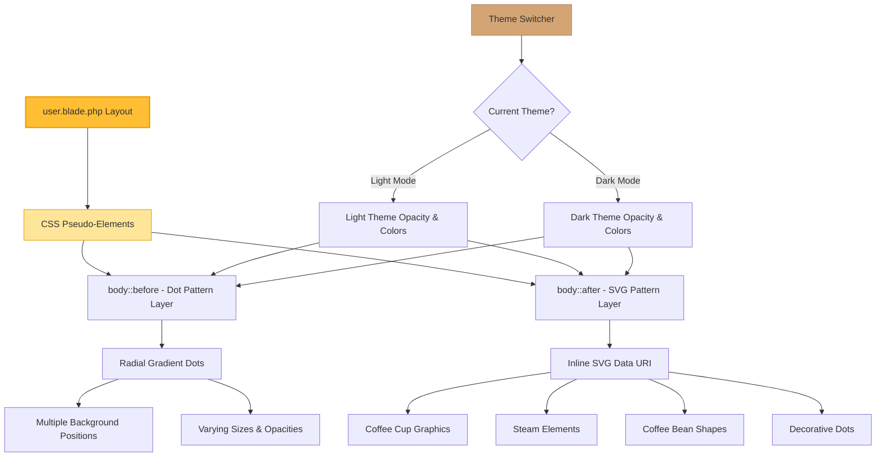
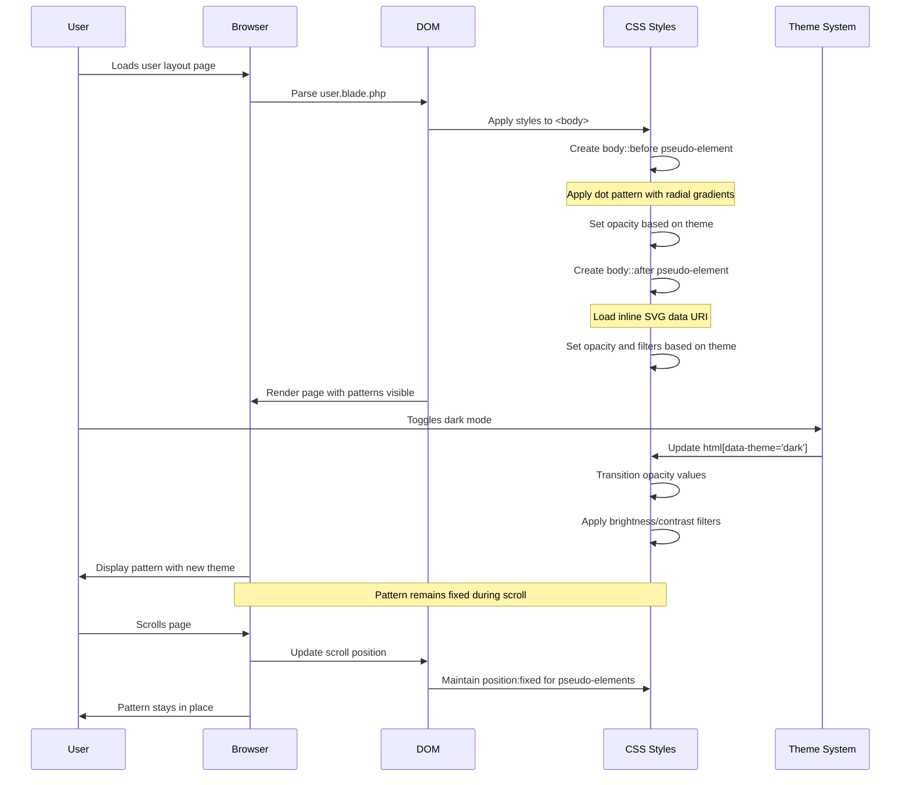

# Design Document: Fix Background Pattern Visibility

## Overview

The background batik pattern on the user layout page is currently implemented using CSS pseudo-elements (`body::before` and `body::after`) with coffee-themed visual elements (dots representing coffee beans, SVG graphics of coffee cups, steam, and decorative elements). However, the pattern is not visible due to extremely low opacity values (0.08-0.12). This design addresses the visibility issue while maintaining a subtle, elegant appearance that complements both light and dark modes without interfering with content readability.

The solution involves a multi-faceted approach: increasing opacity values significantly, adjusting color contrast for better visibility, optimizing SVG stroke widths and element sizes, and implementing enhanced visual depth through layering and subtle effects.

## Architecture



## Components and Interfaces

### Component 1: Dot Pattern Layer (body::before)

**Purpose**: Creates a repeating pattern of dots at various positions and sizes to simulate scattered coffee beans

**CSS Structure**:
```css
body::before {
  content: '';
  position: fixed;
  inset: 0;
  z-index: -1;
  opacity: [NEW_VALUE];
  background-image: [RADIAL_GRADIENTS];
  background-size: [SIZES];
  background-position: [POSITIONS];
  transition: opacity var(--rc-theme-transition);
}
```

**Responsibilities**:
- Provide base texture layer using radial gradient dots
- Support multiple dot sizes (1px - 2.5px radius)
- Position dots in scattered, organic pattern
- Respond to theme changes with appropriate opacity
- Remain fixed during scrolling

### Component 2: SVG Pattern Layer (body::after)

**Purpose**: Displays detailed coffee-themed graphics including cups, steam, beans, and decorative elements

**CSS Structure**:
```css
body::after {
  content: '';
  position: fixed;
  inset: 0;
  z-index: -1;
  opacity: [NEW_VALUE];
  background-image: url("data:image/svg+xml,[SVG_CONTENT]");
  background-size: [SIZE];
  background-position: 0 0;
  transition: opacity var(--rc-theme-transition), filter var(--rc-theme-transition);
  filter: [THEME_SPECIFIC_FILTER];
}
```

**Responsibilities**:
- Display detailed coffee iconography via inline SVG
- Tile seamlessly across viewport
- Apply theme-specific color adjustments via CSS filters
- Maintain visual hierarchy below content (z-index: -1)
- Transition smoothly between theme states

### Component 3: Theme Responsive System

**Purpose**: Adjust pattern visibility and appearance based on active theme (light/dark)

**CSS Structure**:
```css
/* Light mode defaults */
body::before { opacity: [LIGHT_VALUE_1]; }
body::after { opacity: [LIGHT_VALUE_2]; }

/* Dark mode overrides */
html[data-theme='dark'] body::before { 
  opacity: [DARK_VALUE_1]; 
}
html[data-theme='dark'] body::after { 
  opacity: [DARK_VALUE_2];
  filter: brightness([VALUE]) contrast([VALUE]);
}
```

**Responsibilities**:
- Define separate opacity values for light and dark themes
- Apply visual filters to enhance dark mode visibility
- Use CSS custom properties for theme transition timing
- Ensure pattern remains subtle in both modes

## Data Models

### Pattern Configuration Model

```css
:root {
  /* Opacity values - to be adjusted */
  --pattern-dot-opacity-light: 0.20;
  --pattern-dot-opacity-dark: 0.28;
  --pattern-svg-opacity-light: 0.15;
  --pattern-svg-opacity-dark: 0.22;
  
  /* Color values */
  --pattern-coffee-gold: #d4a574;
  --pattern-coffee-brown: #a67c52;
  
  /* Size values */
  --pattern-dot-size-small: 1px;
  --pattern-dot-size-medium: 1.5px;
  --pattern-dot-size-large: 2.5px;
  
  /* SVG pattern tile size */
  --pattern-tile-size: 120px;
}
```

**Validation Rules**:
- Opacity values must be between 0.0 and 1.0
- Light mode opacity should generally be lower than dark mode
- Dot sizes should increase progressively (small < medium < large)
- Tile size should be large enough to prevent excessive repetition

### SVG Graphics Model

```xml
<svg width='[TILE_SIZE]' height='[TILE_SIZE]' viewBox='0 0 [SIZE] [SIZE]' xmlns='http://www.w3.org/2000/svg'>
  <g fill='none' stroke='[COLOR]' stroke-width='[WIDTH]' opacity='1'>
    <!-- Coffee Cup Path -->
    <path d='...' stroke-linecap='round' stroke-linejoin='round'/>
    
    <!-- Cup Handle -->
    <path d='...' stroke-linejoin='round'/>
    
    <!-- Steam Lines -->
    <path d='...' stroke-linecap='round' opacity='0.7'/>
    
    <!-- Coffee Beans -->
    <ellipse cx='...' cy='...' rx='...' ry='...' fill='[COLOR]' opacity='0.5'/>
    <path d='...' stroke='#fff' stroke-width='...' opacity='0.8'/>
    
    <!-- Decorative Dots -->
    <circle cx='...' cy='...' r='...' fill='[COLOR]' opacity='0.6'/>
  </g>
</svg>
```

**Validation Rules**:
- All stroke-width values must be >= 1.5 for visibility
- Opacity for decorative elements should be 0.5-0.8
- Colors must use hex format for URL encoding compatibility
- ViewBox dimensions must match width/height attributes

## Sequence Diagram



## Correctness Properties

*A property is a characteristic or behavior that should hold true across all valid executions of a system—essentially, a formal statement about what the system should do. Properties serve as the bridge between human-readable specifications and machine-verifiable correctness guarantees.*

### Property 1: Pattern Visibility Threshold

*For any* viewport rendering, the background pattern opacity values SHALL be sufficiently high that visual elements are perceptible to users with normal vision under standard display conditions (minimum 0.15 for light mode, 0.20 for dark mode).

**Validates: Requirements 1.1, 1.2, 1.3, 1.4**

### Property 2: Theme-Specific Opacity Consistency

*For any* theme state (light or dark), the pattern opacity values SHALL be greater in dark mode than in light mode to compensate for reduced contrast in dark backgrounds.

**Validates: Requirements 3.1**

### Property 3: Content Readability Preservation

*For any* content displayed over the background pattern, text readability SHALL NOT be degraded—the pattern SHALL remain subtle enough that it does not interfere with reading body text, headings, or interactive elements.

**Validates: Requirements 4.1, 4.2, 4.3, 4.4**

### Property 4: SVG Element Size Adequacy

*For all* SVG pattern elements (strokes, circles, paths), stroke-width and radius values SHALL be increased by at least 25% from current values to ensure visibility at the pattern's intended scale.

**Validates: Requirements 2.1, 2.2, 2.3, 2.4**

### Property 5: Pattern Layer Stacking

*For any* content on the page, both pseudo-elements (body::before and body::after) SHALL maintain z-index: -1 to ensure pattern layers remain behind all page content.

**Validates: Requirements 4.1**

### Property 6: Color Contrast Differentiation

*For any* theme mode, pattern colors SHALL provide sufficient contrast against the background color—using darker shades for light mode and lighter/enhanced shades for dark mode.

**Validates: Requirements 6.1, 6.2, 6.3, 6.4, 6.5**

### Property 7: Smooth Theme Transitions

*For any* theme switch operation, opacity and filter property changes SHALL transition smoothly using CSS transitions without jarring visual changes.

**Validates: Requirements 3.4, 3.5**

### Property 8: Pattern Position Stability

*For any* scroll position, the background pattern SHALL remain fixed relative to the viewport (not scroll with content) to maintain a stable visual anchor.

**Validates: Requirements 5.1, 5.2, 5.3, 5.4**

## Error Handling

### Error Scenario 1: Pattern Not Visible After Changes

**Condition**: After applying opacity increases, pattern still not visible or barely visible  
**Response**: Browser caching or CSS specificity issue—clear browser cache, verify no conflicting styles with higher specificity  
**Recovery**: Incrementally increase opacity values by 0.05 until pattern becomes visible; add `!important` flag if necessary to override conflicting styles

### Error Scenario 2: Pattern Too Prominent/Distracting

**Condition**: Pattern opacity is too high, interfering with content readability  
**Response**: Reduce opacity values in smaller increments (0.02-0.03 at a time)  
**Recovery**: Find optimal balance through iterative testing; consider reducing pattern density or element sizes instead of just opacity

### Error Scenario 3: SVG Not Rendering

**Condition**: body::after shows no pattern despite CSS being applied  
**Response**: SVG data URI encoding issue—special characters not properly URL-encoded  
**Recovery**: Validate SVG XML syntax, ensure all special characters in data URI are properly encoded, test SVG directly in browser first

### Error Scenario 4: Poor Visibility in Dark Mode

**Condition**: Pattern disappears or becomes too faint when dark mode is activated  
**Response**: Dark mode opacity too low or color contrast insufficient  
**Recovery**: Increase dark mode opacity further, apply brightness(1.4-1.6) and contrast(1.1-1.2) filters to lighten pattern colors

### Error Scenario 5: Pattern Causes Performance Issues

**Condition**: Multiple complex background layers cause sluggish rendering or high GPU usage  
**Response**: Browser struggling with layered backgrounds and filters  
**Recovery**: Simplify one layer (reduce number of radial gradients in body::before or simplify SVG paths), consider using a single optimized background image instead

### Error Scenario 6: Inconsistent Appearance Across Browsers

**Condition**: Pattern looks different in Chrome vs Firefox vs Safari  
**Response**: Browser-specific rendering differences for radial gradients or SVG filters  
**Recovery**: Test across target browsers, add vendor prefixes if needed, adjust opacity/color values per browser using CSS feature queries

## Testing Strategy

### Visual Regression Testing Approach

Since this is a visual/CSS design task, testing will primarily be manual and visual:

1. **Cross-Browser Visual Testing**:
   - Test in Chrome, Firefox, Safari, Edge
   - Verify pattern visibility in each browser
   - Check for rendering inconsistencies

2. **Theme Testing**:
   - Verify pattern visibility in light mode
   - Verify pattern visibility in dark mode
   - Test theme switching transitions

3. **Viewport Testing**:
   - Test on desktop resolutions (1920x1080, 1366x768, 2560x1440)
   - Test on tablet resolutions (768x1024, 1024x768)
   - Test on mobile resolutions (375x667, 414x896)

4. **Readability Testing**:
   - Verify text remains readable over pattern
   - Check button and interactive element visibility
   - Ensure no visual interference with content

5. **Performance Testing**:
   - Monitor page render time with DevTools
   - Check for layout thrashing or excessive repaints
   - Verify smooth scrolling performance

### Unit Testing Approach

CSS properties can be tested programmatically:

```javascript
// Example: Verify opacity values are applied correctly
describe('Background Pattern Visibility', () => {
  test('body::before has correct opacity in light mode', () => {
    const styles = window.getComputedStyle(document.body, '::before');
    expect(parseFloat(styles.opacity)).toBeGreaterThanOrEqual(0.15);
  });
  
  test('body::after has correct opacity in dark mode', () => {
    document.documentElement.setAttribute('data-theme', 'dark');
    const styles = window.getComputedStyle(document.body, '::after');
    expect(parseFloat(styles.opacity)).toBeGreaterThanOrEqual(0.20);
  });
});
```

### Property-Based Testing Approach

Not applicable for this CSS/visual design task—property-based testing is better suited for algorithmic logic and data transformation.

## Performance Considerations

1. **Rendering Performance**:
   - Fixed positioning prevents pattern reflow during scrolling
   - CSS transitions use GPU-accelerated properties (opacity, filter)
   - Radial gradients are performant when count is kept reasonable (6-8 max)

2. **Memory Usage**:
   - Inline SVG data URI is efficient for small graphics (<5KB)
   - Fixed backgrounds are cached by browser
   - No additional HTTP requests needed

3. **Paint Performance**:
   - Pseudo-elements with z-index: -1 minimize paint complexity
   - Pattern changes don't trigger layout recalculations
   - Filter effects may increase paint time slightly in dark mode

4. **Optimization Recommendations**:
   - Keep total radial gradient count under 8 for body::before
   - Limit SVG complexity to essential shapes only
   - Use CSS containment if performance issues arise: `contain: paint`

## Security Considerations

1. **Content Security Policy (CSP)**:
   - Inline SVG data URIs must be allowed: `img-src data:`
   - No external resources loaded, minimizing XSS risk

2. **Data URI Safety**:
   - SVG content is static and controlled (no user input)
   - Properly encoded to prevent injection attacks
   - No JavaScript embedded in SVG

3. **Theme System**:
   - Theme attribute changes via localStorage are validated
   - No sensitive data exposed through CSS variables

## Dependencies

### External Dependencies
- **None**: Solution uses pure CSS with no external libraries

### Internal Dependencies
- **Theme System**: Depends on existing `html[data-theme]` attribute toggling
- **CSS Variables**: Uses existing `--rc-theme-transition` variable
- **Layout File**: Modifications confined to `resources/views/layouts/user.blade.php`

### Browser Support
- **Modern Browsers**: Chrome 88+, Firefox 85+, Safari 14+, Edge 88+
- **CSS Features Used**:
  - Pseudo-elements (::before, ::after) - widely supported
  - Radial gradients - widely supported
  - SVG data URIs - widely supported
  - CSS filters - widely supported
  - Fixed positioning - widely supported

## Implementation Details

### Current State Analysis

**body::before (Dot Layer)**:
- Current opacity: 0.08 (light), 0.12 (dark)
- Current dot sizes: 1px, 1.2px, 1.5px radius
- Current background: 6 radial gradients
- **Issue**: Opacity too low, dots too small

**body::after (SVG Layer)**:
- Current opacity: 0.06 (light), 0.10 (dark)
- Current stroke-width: 1.2px
- Current pattern size: 100x100px
- **Issue**: Opacity extremely low, stroke too thin, elements too small

### Proposed Changes

**Opacity Increases**:
- body::before light mode: 0.08 → 0.20 (+150%)
- body::before dark mode: 0.12 → 0.28 (+133%)
- body::after light mode: 0.06 → 0.15 (+150%)
- body::after dark mode: 0.10 → 0.22 (+120%)

**Size Increases**:
- Dot radii: 1px → 1.5px, 1.2px → 1.8px, 1.5px → 2.5px
- SVG stroke-width: 1.2px → 2.0px
- Pattern tile: 100px → 120px (larger elements)

**Color Enhancements**:
- Light mode: Keep #d4a574 but increase opacity
- Dark mode: Add `filter: brightness(1.5) contrast(1.1)` to lighten

**Additional Improvements**:
- Add subtle blur to body::before: `filter: blur(0.5px)` for softer appearance
- Increase coffee bean ellipse sizes: rx/ry from 4/6 to 5/7
- Increase decorative dot radii: 1-1.5 → 1.5-2
- Add slight rotation variation to beans for organic feel

### Visual Mockup Comparison

**Before** (Current):
- Pattern nearly invisible
- Opacity: 0.06-0.12
- Elements tiny and faint

**After** (Proposed):
- Pattern clearly visible but subtle
- Opacity: 0.15-0.28
- Elements properly sized and visible
- Maintains elegant, non-distracting aesthetic

## Conclusion

This design provides a comprehensive solution to the background pattern visibility issue by systematically addressing multiple factors: opacity, element sizing, color contrast, and theme-specific adjustments. The approach maintains the elegant coffee theme aesthetic while ensuring the pattern serves its intended decorative purpose without compromising content readability or page performance.
